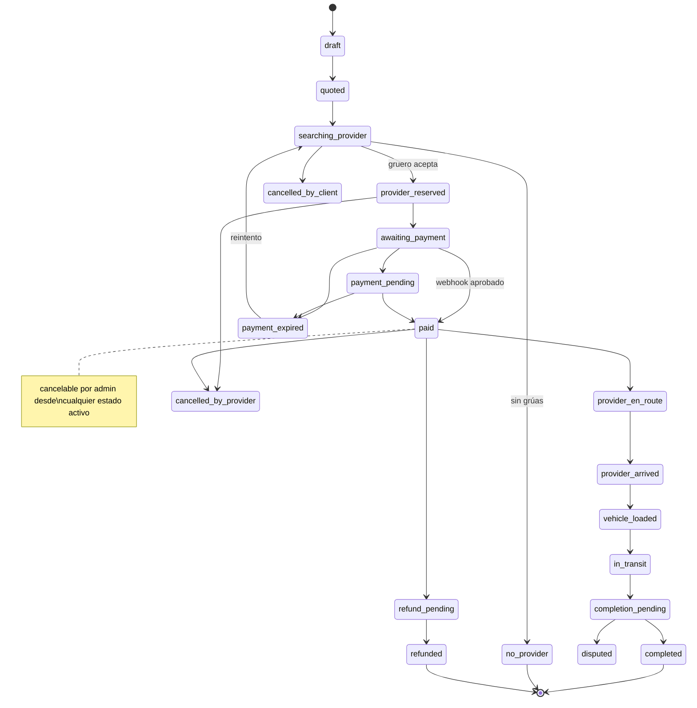

# Estados de la orden — gruafy

Fuente: `src/features/orders/state-machine.ts` (con tests en `tests/unit/state-machine.test.ts`).
Cada transición define actor autorizado y evento; se registra en `order_events`.

## Diagrama

## Estados terminales
`completed`, `no_provider`, `payment_expired`, `cancelled_by_client`, `cancelled_by_provider`,
`cancelled_by_admin`, `refunded`.

## Actores
- `client`: inicia búsqueda, cancela antes del inicio, disputa, califica.
- `provider`: acepta (atómico), avanza el recorrido, carga adicionales.
- `admin`: asigna/cancela, aprueba proveedores, reembolsa.
- `system`: confirma pago (webhook), expira, marca sin proveedor.

Reglas clave: nunca se actualiza el estado desde el cliente sin pasar por la máquina; se previenen
saltos inválidos; la aceptación es atómica (RPC `accept_offer`).
