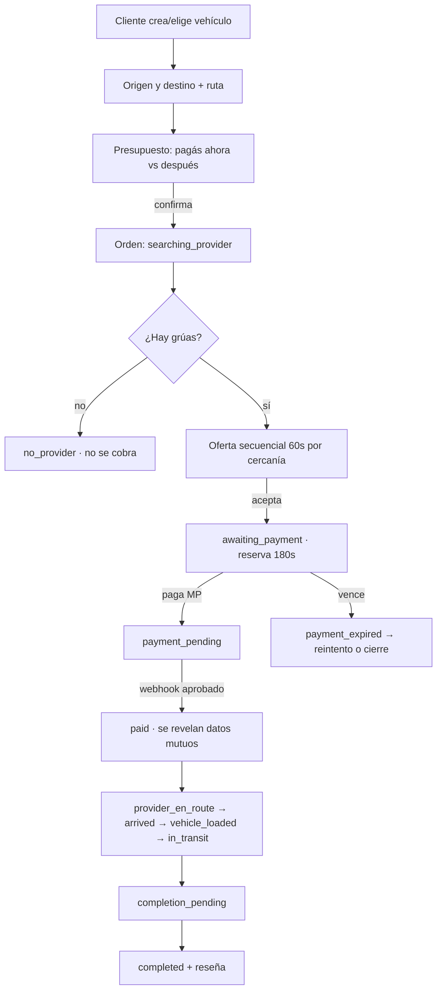
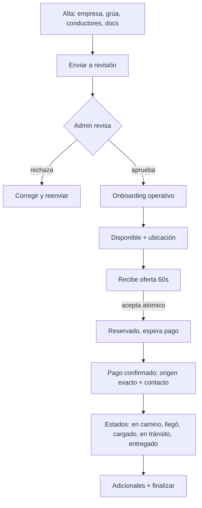
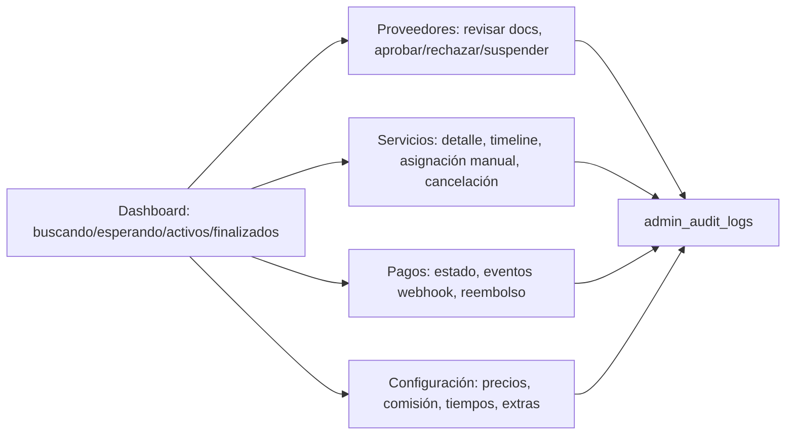

# Flujos — gruafy

## B2C — pedir, pagar, seguir, cerrar



## B2B — grúa



## Pagos (Mercado Pago)

```mermaid
sequenceDiagram
  participant C as Cliente
  participant S as Servidor gruafy
  participant MP as Mercado Pago
  C->>S: Confirma pago del anticipo
  S->>MP: Crea preference (external_reference = orderId, idempotency)
  MP-->>C: Checkout Pro
  C->>MP: Paga
  MP-->>S: Webhook (x-signature)
  S->>S: Valida firma, request-id, live_mode, moneda, importe
  S->>MP: GET /payments/{id} (server-to-server)
  MP-->>S: Estado real
  S->>S: Idempotente → paid; revela datos; order_events
  Note over S,C: El retorno del navegador NO confirma el pago.
```

## Admin


