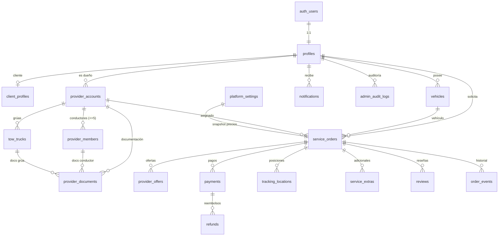

# Modelo de datos — gruafy

Fuente de verdad: `supabase/migrations/`. Tipos TS en `src/types/database.ts`.

## Diagrama (Mermaid)

## Tablas

| Tabla | Rol | Notas |
|-------|-----|-------|
| `profiles` | 1:1 con `auth.users` | rol, nombre, teléfono, estado. |
| `client_profiles` | datos de cliente | DNI, verificaciones. |
| `vehicles` | vehículos del cliente | marca/modelo/año, patente, caja, llaves, soft delete. |
| `provider_accounts` | cuenta = 1 grúa | razón social, CUIT, estado de aprobación, disponibilidad, última ubicación, rating. |
| `provider_members` | dueño + conductores | límite de 5 conductores por trigger. |
| `tow_trucks` | grúas | patente, capacidad. |
| `provider_documents` | documentación | tipo, número, `storage_path` privado, vencimiento, estado de revisión. |
| `service_orders` | órdenes | origen/destino con lat/lng, condiciones, distancia/duración, **snapshot `pricing`**, `amount_upfront`, estado, deadlines, timestamps de hitos. |
| `provider_offers` | ofertas secuenciales | rank, vencimiento, estado; único `(order_id, provider_id)`. |
| `payments` | pagos MP | preference/payment id, external_reference, importe, estado, `live_mode`, idempotency, payload normalizado. |
| `refunds` | reembolsos | importe, motivo, estado, id externo. |
| `tracking_locations` | posiciones | lat/lng, precisión, heading, velocidad. |
| `service_extras` | adicionales | categoría, motivo, importe, evidencia, validación. |
| `reviews` | reseñas | 1–5, único por `(order_id, author_id)`. |
| `notifications` | notificaciones internas | tipo, título, cuerpo, link, leída. |
| `support_articles` | centro de ayuda | rol objetivo, slug, publicado. |
| `platform_settings` | parámetros | fila única versionada (precios, tiempos, extras). |
| `order_events` | historial inmutable | from/to state, actor, evento. |
| `admin_audit_logs` | auditoría admin | acción, entidad, antes/después. |

## Restricciones e índices clave

- Importes con `check (>= 0)`; rating `between 1 and 5`; año de vehículo acotado.
- Límite de 5 conductores por proveedor: trigger `enforce_member_limit`.
- Índices por estado, fechas, usuario, proveedor y orden (ver final de `0001_schema.sql`).

## Seguridad (RLS)

Ver `docs/SEGURIDAD.md` y `supabase/migrations/0003_rls.sql`. Regla base: cada quien ve/edita lo
suyo; antes del pago no se cruzan datos privados entre cliente y proveedor; el admin accede por rol
verificado en servidor; los documentos van en buckets privados y se sirven con URL firmada corta.
